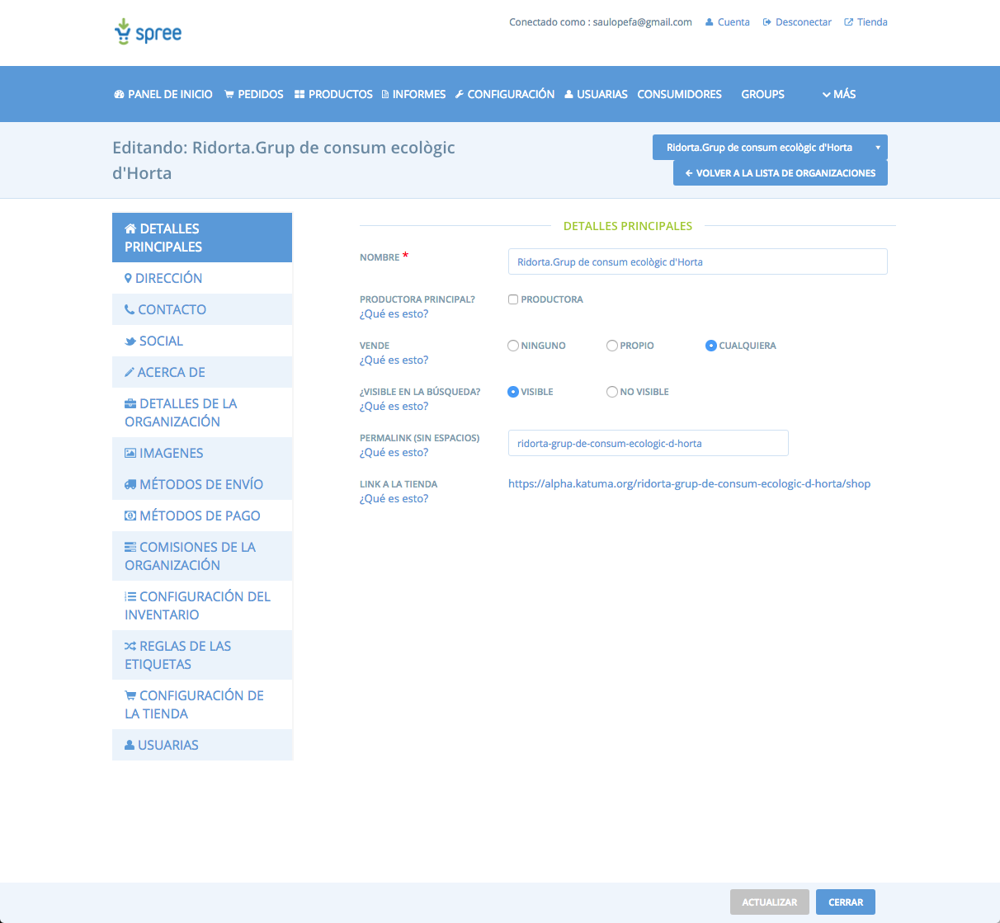

# Katuma

---

### Visió

Superar els reptes que té el sector d'agricultura ecològica i de proximitat per tal de fer un salt d'escala que el permeti sobreviure als temps

---

### Objectius

* Que la gent no abandoni els grups de consum.

* Permetre als grups centrar-se en ser eina de transformació fent altres
    activitats més enllà de la gestió diària: Cinefòrum, xerrades, fires,
    sensibilització, comunicació, etc.

* Que més gent vulgui formar part d'un grup de consum.

* Potenciar productors petits i de proximitat que s'escapen del control de la
    gran indústria alimentària

* Permetre a aquests productors ampliar volum de negoci sense dedicar-hi més hores

* Proporcionar nous clients a aquests productors

* Reduir els costos de la distribució de productors a grups de consum

* Construir la intercooperació entre el sector que permeti afrontar els reptes de futur amb més garanties d'èxit.

---

### Mitjans

* Simplificar la gestió de les comandes al productor i el seu repartiment a través d'una plataforma tecnològica

* Esdevenir una cooperativa de membres del sector d'agricultura ecològica i de proximitat catalana que tingui la propietat sobre aquesta plataforma i permeti afrontar els reptes com a sector.

---

### Objectius pel 2018

* Implicar la comunitat
* Acompanyar als actors: grups, productores i usuàries
* Enllestir MVP (Producte mínim viable)
* Projecte Empresarial

---

## Com crear un compte pel grup de consum

1. Clicar a "¿Estás interesada en entrar en Open Food Network? Regístrate aquí"
2. Seguir els passos

Instruccions en format video: [https://www.youtube.com/watch?v=ySTJ31gRzHg](https://www.youtube.com/watch?v=ySTJ31gRzHg)

---

## Com crear un compte d'usuari

1. Clicar a "Iniciar sesión" > "Registrarse"

---

## Com configurar la botiga

---

### Associar membres amb el grup

Des de la secció d'administració:

1. Clicar a "Consumidores"
2. Seleccionar la botiga al llistat
3. Clicar a "Nuevo consumidor"
4. Afegir email amb el que l'usuari s'ha registrat a Katuma
5. Clicar a "Añadir consumidor"

---

## Procés de comanda

---

### Cicle de comanda

Des de la secció d'administració:

1. Clicar a "Ciclos de pedidos"
2. Escollir dates d'obertura i tancament
3. Afegir productor i els productes que es podran comprar a "Entrante"
4. Afegir grup de consum i els productes que repartirà a "Saliente"

---

### Fer una comanda

Requisits:

1. Tenir un compte a Katuma
2. Estar associat al grup de consum

Video d'instruccions del grup Ridorta: [https://www.youtube.com/watch?v=GiB4t6KZu_Q](https://www.youtube.com/watch?v=GiB4t6KZu_Q)

---

### Notificar al productor

FAQ: [http://community.coopdevs.org/t/faq-preguntes-frequents-de-katuma/341](http://community.coopdevs.org/t/faq-preguntes-frequents-de-katuma/341)

---

## Fer el repartiment

Guia: [http://community.coopdevs.org/t/guia-repartiment-de-comandes/280](http://community.coopdevs.org/t/guia-repartiment-de-comandes/280)

---

### Consultar comandes

Guia: [http://community.coopdevs.org/t/guia-repartiment-de-comandes/280](http://community.coopdevs.org/t/guia-repartiment-de-comandes/280)

---

## Factures

Des de la secció d'administració:

1. Clicar a un número de comanda
2. Clicar a "Acciones" > "Imprimir factura"

## Preguntes?

[community.coopdevs.org](community.coopdevs.org)
